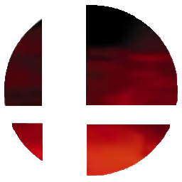

# melee-nx

Super Smash Bros. Melee on Nintendo Switch, built as a native homebrew NRO from
[melee-pc](https://github.com/999sian/melee-pc). The game compiles directly to
AArch64; rendering uses Aurora GX, Dawn, and Mesa NVK.

You supply your own **NTSC-U 1.02 (GALE01)** disc image. This repository contains
the Switch integration and patches, with no game assets or vendored game source.

[Build and install](BUILDING.md) · [Contribute](CONTRIBUTING.md) ·
[Documentation](docs/README.md)

## Status

Playable, with performance work ongoing. Menus, gameplay, audio, controller
remapping, and sideways single Joy-Cons work. Geometry can appear late while
shader pipelines compile, and busy scenes and load transitions still hitch.
Audio latency and sustained 60 FPS remain open work.

A September 21, 2026 capture of a four-fighter game at 720p and stock clocks
averaged **55.4 FPS** over a representative seven-minute window. A later scene
averaged **42.4 FPS**. These describe one recorded session; subsequent feature
builds have not been measured under the same conditions.

## Install

Copy the NRO and your disc image to an Atmosphère SD card:

```text
sdmc:/switch/melee-nx/melee.nro
sdmc:/switch/melee-nx/GALE01.iso
```

Launch from the Homebrew Menu. The first run offers to extract the game into
`files/`, or play directly from the image. After extraction and a successful
disc boot have created `disc.meta` and `disc-boot.bin`, the game can boot without
the image. Keep those metadata files alongside the NRO.

Startup and runtime logs are written to `melee-nx-boot.log` and
`melee-nx-runtime.log` in the same directory. See the
[installation guide](BUILDING.md#installing-on-the-console) for details.

## Build

Builds run in Docker. You can use a toolchain image with an external Mesa/NVK
build, or package both into a reusable SDK image that needs no neighboring
checkout. Start with [BUILDING.md](BUILDING.md); image creation and transfer are
documented in [the Docker guide](switch/docker/README.md).

## Layout

| Path | Contents |
|---|---|
| `builder/` | Dependency fetcher, container wrapper, build stages, checks |
| `switch/src/` | Startup, platform adapters, disc reader, cache and logging support |
| `switch/cmake/` | Toolchain, graphics imports, linker configuration |
| `switch/patches/` | Changes applied to upstream sources |
| `switch/docker/` | Reusable toolchain and SDK image recipes |
| `docs/` | Maintained contributor documentation and local working notes |
| `ref/`, `build/` | Local dependencies and build outputs; ignored by Git |

## Credits

- [melee-pc](https://github.com/999sian/melee-pc), by 999sian, and its vendored Aurora fork
- [Aurora](https://github.com/encounter/aurora) and [Dawn](https://dawn.googlesource.com/dawn), including encounter's Switch work
- [Mesa/NVK](https://docs.mesa3d.org/drivers/nvk.html), the Vulkan driver
- [Dusklight-NX](https://github.com/souldbminerr/dusklight-nx), for the SDL backend and CPU techniques
- [KartPad-NX](https://github.com/KawaiiBunga/Kartpad-NX), for Switch toolchain and platform integration work
- [devkitPro](https://devkitpro.org/), for devkitA64 and libnx

## License and support

Port code in `switch/` and `builder/` is GPL-3.0-or-later, matching melee-pc.
Game source under `ref/melee-pc/src/melee` and `ref/melee-pc/src/sysdolphin`
remains Nintendo's property and is not licensed by this project. Do not commit
game source, disc images, or extracted assets.

You can support this and my other projects on [Ko-fi](https://ko-fi.com/kawaiibunga).
